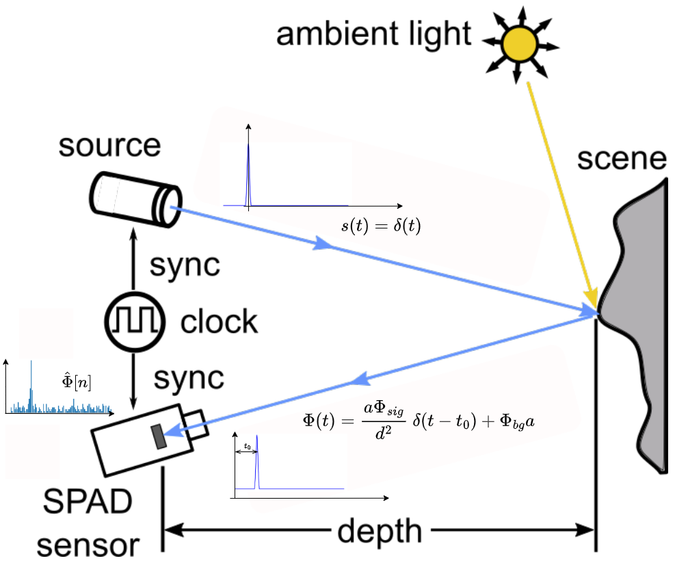
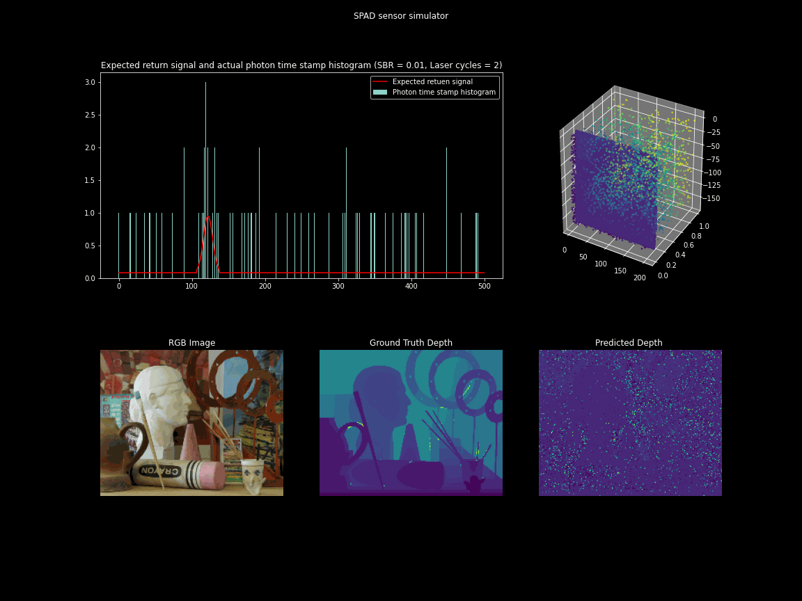

# Simulating Single Photon Cameras for Supervised Depth Estimation

<!-- Place this tag where you want the button to render. -->
<a class="github-button" href="https://github.com/kaustubh-sadekar/SPAD-Simulator" target="blank_" data-color-scheme="no-preference: light; light: light; dark: dark;" data-size="large" aria-label="Star kaustubh-sadekar/SPAD-Simulator on GitHub">Star Repository</a>

## Project in brief
SPAD-based cameras are becoming a popular choice of sensors for direct time-of-flight 3D imaging systems. However, the depth estimates are significantly affected when the ambient light is stronger than the light source used by the 3D imaging system. This project aims to simulate a SPAD sensor and study the effect of laser power, background light strength, scene depth, and albedo on the SPAD sensor measurements. *Note: The objective of this simulator is to generate SPAD data from existing RGB-D dataset hence multi-path interference is not considered in this simulator as it is difficult and computationally expensive to estimate the light transport from a single RGB-D frame. Hence the scene response function (SRF) of a 3D point is a time-shifted impulse where the time shift is proportional to the scene depth*.

## SPAD-based time of flight imaging model

A time of flight (ToF) imaging system has three major components - An active light source, a photodetector, and a circuit that records, compute, and transfers the time elapsed (time of flight) between the emission and detection of the signal photons. In a SPAD-based direct ToF imaging system, the active light source is a laser, and the photodetector is a SPAD pixel.

The following image illustrates the direct ToF imaging model for a SPAD-based ToF imaging system. The light source (an infrared laser) emits signal photons as periodic laser pulse s(t) = &delta;(t). The laser pulse interacts with the 3D scene and is reflected back. Finally, the SPAD pixel detects the reflected signal photons, and the time elapsed between the emission and detection of the signal is measured as the time of flight ( t0 ). The scene depth is obtained by multiplying $t_0$ with the speed of light and dividing by two.

  

    Figure 1 - Diagram explaining the imaging model for SPAD-based ToF imaging system. <i>Modified version of the diagram from [1]</i>.

`So why is it so difficult to estimate depth? - we can start the timer as the laser emits the signal and stop the timer when the signal is detected.`

  

    <a href="https://user-images.githubusercontent.com/42736936/213940266-6c7e6413-c015-4146-b4a7-4f5addc33840.png"> <i> Image source </i> </a>.

Theoretically, we can estimate the time of flight ( t_0 ) by measuring the delay between the peak of the source signal s(t) and the received signal r(t). As the source signal is in our control its peak can be set to t = 0 hence the real challenge is in finding the accurate peak location of the received signal. Multiple factors make this a challenging task.

1. SPAD measurements are discrete.
  SPAD measurements are discrete hence we cannot measure the full continuous waveform of the received signal but only sample it and try to estimate or approximate it. The technique used in SPAD-based single-photon cameras to sample r(t) is called timecorrelated single-photon counting(TCSPC). The timestamps for each detected photon are recorded for multiple laser cycles and finally, a histogram of photon timestamps is created denoted by h[n].

2. Photon arrival is nondeterministic in nature.
  SPADs are fast enough to capture individual photons hence we can achieve a high sampling rate using SPADs. However, it is important to note that $\Phi(t)$ represents the expected received signal and not the actual photon timestamp histogram. Hence, even if we can avoid the pile-up effect and capture every photon incident on the SPAD pixel, the photon timestamp histogram would still not look like a quantized/ sampled version of $\Phi(t)$. This is because the photon timestamps follow a Poisson distribution where the value of $\Phi(t)$ represents the expected number of photons detected in a given time interval but the actual photon counts may vary. Hence, if the photon timestamps are not recorded for a sufficient number of laser cycles the peak of the photon timestamp histogram may not correspond to the received signal $\Phi(t)$ resulting in inaccurate depth estimates. The following GIF illustrates this phenomenon for a single SPAD pixel using our SPAD simulator.

    

      
    

    

        Figure 2 - GIF illustrating the effect of photon randomness on the measured photon timestamp histogram and its deviation from the expected received signal. We observe that increasing the number of laser cycles takes the measured histogram closer to the return signal waveform.
    

3. Poor signal-to-background ratio (SBR). SBR is the ratio of the expected number of signal photons ($Phi_{sig}$) to the expected number of background photons ($\Phi_{bg}$). In the case of poor SBR scenarios, the difference between the expected number of signal photons and background photons is less hence there is a high probability that the SPAD pixel measures more background photons than the signal photons resulting in noisy histograms with inaccurate peak and hence noisy depth estimates. The following GIF illustrates the effect of SBR on the measured histogram and the depth estimates.
  
  
    

      
    

    

        Figure 3 - GIF illustrating the effect of SBR on the measured histogram and the corresponding depth estimates.
    

## Major steps of the SPAD simulator

### Calculate the time-of-flight (t0) from the ground truth depth value.
We use the following formula t0 = 2d/c where d is the ground truth depth value and c is the speed of light. This is treated as the scene response function (SRF) which indicates the amount of delay a 3D point induces to the return signal. The actual SRF would also include the multi-path interference effect and would highlight the overall light transport properties at that scene point.

### Modelling the probing function or the laser pulse s(t) = &delta;(t). 
An ideal pulse would have a non-zero value at t0 and zero elsewhere. However, this is practically impossible to achieve. The actual shape of the waveform is limited due to three major physical properties of the laser diode (i) rise time (time taken for the laser intensity to reach from zero to maximum), (ii) fall time (opposite of rise time) and (iii) laser power - To emit a desired amount of energy with a limited power laser source we need to keep the laser on for some minimum non-zero amount of time which determines the laser pulse width.
  
1. Modelling the pulse as a gaussian - Instead of considering the rise time, fall time, and the laser pulse width individually we combine these and approximate the pulse with a gaussian. 

2. Full width half maximum (FWHM) - This is one of the controllable parameters of the simulator. It controls the width of the laser pulse. Since we are approximating the laser pulse as a gaussian, we can change the standard deviation by changing the FWHM value. The &sigma; of gaussian kernel is calculated using the following formula: FWHM = 2.355 &sigma; The following GIF illustrates the effect of FWHM on the laser pulse, measured histogram, and depth estimates. It shows that higher FWHM increases uncertainty in the depth estimates.

    

      
    

    

        Figure 4 - GIF illustrating the effect of FWHM on the laser pulse and the corresponding depth estimates.
    

3. Setting the laser power - The laser power can be controlled using another controllable parameter &Phi;sig. It is the average number of signal photons (or laser photons) per laser cycle. The following GIF illustrates the effect of &Phi;sig on the signal-to-background ratio (SBR) and the depth estimates. We observe that reducing the &Phi;sig results in poor SBR and increasing it results in better SBR.

    

      
    

    

        Figure 5 - GIF illustrating the effect of laser power on the SBR and the depth estimates.
    

4. Setting the laser time period - This is another parameter that can be controlled in the simulator. Changing the time period T changes the maximum depth value that can be measured as dmax = Tc/2, where c is the speed of light.

Finally, we apply the effect of the scene response function (time delay calculated in the first step) by convolving the generated gaussian kernel with the SRF to finally get the &sigma;(t - t0). 

### Adding the background noise
In most scenarios, there are other ambient light sources present in the scene. Hence the photons incident on SPAD pixels may either be signal photons originating from the laser or the background photons originating from the ambient light sources. For simplicity, we assume that the average number of background photons is constant. We control the average number of ambient photons by a &Phi;bg in our simulator. It is added as a constant DC shift to the above returning signal equation. The following GIF illustrates the effect of &Phi;bg on the SBR, the photon timestamps and the depth estimates.

### Simulating the effect of scene albedo and depth

1. Effect of scene albedo.
  The scene albedo (or color) has a similar effect on the signal photons and the background photons. It scales the average number of photons by a factor *a* ranging between 0 and 1. Objects with darker albedo absorb more photons hence the scaling factor is closer to 0. Similarly, the value of *a* for brighter objects is close to 1. The effect of albedo is incorporated into the simulation by multiplying the expected signal photons and background photons 

2. Effect of scene depth on signal photons.
  The average number of signal photons in the received signal reduces by the square of scene depth. This phenomenon is called the inverse square law. As the distance of our imaging system increases from an object, the total illuminated area increases by the square of distance hence the average number of photons received on each point of the object reduces by the square of the distance as the total photons coming out of the laser are constant. This explains why the number of photons returning back from a point in the scene reduces by the square of the distance. This effect is incorporated in the simulation by dividing the average number of signal photons by the square of scene depth. 

3. Effect of scene depth on background photons.
  The inverse square law also applies to the number of photons received by the sensor reflected by some point in the scene. However, we do not observe the object brightness to be inversely proportional to the square of depth because the total number of pixels imaging that object is proportional to the square of the distance. These two phenomenons compensate each other and the total number of photons remains unchanged w.r.t the scene depth. Hence the depth factor does not show up in the calculation of background photons.

The following GIF illustrates the effect of scene albedo and depth on the SPAD measurements. 

  

    
  

  

      Figure 6 - GIF illustrating the effect of scene albedo and depth on the SPAD measurements.
  

### Simulating the Poisson randomness of photons 

Based on the above steps the final received signal can be calculated as &Phi;(t) = (*a* &Phi;sig/d2) &delta;(t - t0) + &Phi;bg *a*. This is the expected received signal at any arbitrary time t. These expected signal values are passed to a Poisson random generator which simulates the photon arrival timestamps. Finally, we accumulate these timestamps and generate the timestamp histogram &Hat;&Phi;[n]. 

`The entire process explained above is vectorized to simulate measurements for all the SPAD pixels of the single photon camera. This significantly increases the simulation speed.`

## Simulating SPAD sensor measurements for different SBR ratios

  

    Figure 7 - GIF illustrating the single photon camera measurements and depth estimates updated over the number of laser cycles for low SBR scenarios.

## .......This page will be updated soon .....................
---

## References
1. F. Gutierrez-Barragan, A. Ingle, T. Seets, M. Gupta and A. Velten, "Compressive Single-Photon 3D Cameras," 2022 IEEE/CVF Conference on Computer Vision and Pattern Recognition (CVPR), New Orleans, LA, USA, 2022, pp. 17833-17843, doi: 10.1109/
CVPR52688.2022.01733.
